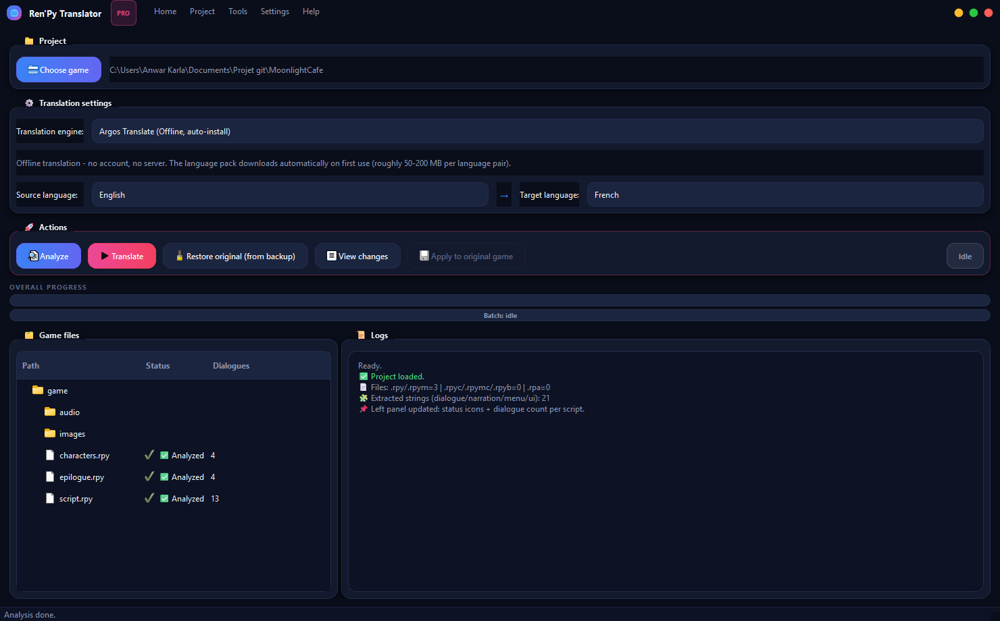

# Ren'Py Translator

A free, open-source desktop app that translates **Ren'Py** visual novels — dialogue, narration, and menu choices — without breaking tags, variables, or the game's `tl/` folder structure.




## Table of Contents

- [What it does](#what-it-does)
- [What's new](#whats-new)
- [Download](#download)
- [Run from source](#run-from-source)
- [How to use it](#how-to-use-it)
  - [A. Source project](#a-source-project-rpy-files-are-visible)
  - [B. Packaged game](#b-packaged-game-only-rpa--rpyc)
- [Choosing a translation engine](#choosing-a-translation-engine)
- [Running LibreTranslate locally (Docker)](#running-libretranslate-locally-docker)
- [What never gets translated, on purpose](#what-never-gets-translated-on-purpose)
- [Logs & troubleshooting](#logs--troubleshooting)
- [Project structure](#project-structure)
- [License](#license)

## What it does

Ren'Py Translator scans a game's `.rpy`/`.rpym` scripts, extracts every user-visible string, sends it to a translation engine of your choice, and writes the result into the standard `game/tl/<language>/` folder Ren'Py expects — so the translation shows up as a normal language option in the game itself, with the original scripts left untouched (backed up first).

It handles two situations:
- **Source projects**, where `.rpy` files are visible and editable.
- **Packaged games**, where the game only ships `.rpa` archives and compiled `.rpyc` scripts. The app extracts and decompiles those into a separate workspace first, so nothing happens to your real install until you choose to apply it.

## What's New

The latest update is a substantial rework of the app, on top of the original scan/translate/write pipeline:

- **Redesigned interface** — a frameless window with a custom title bar, card-based layout, soft shadows, and a live status indicator (idle / working / success / error) instead of the previous flat UI.
- **Four translation engines** instead of one:
  - LibreTranslate (public endpoint or your own local server)
  - Argos Translate — fully offline, no account, no server, downloads its language pack automatically on first use
  - Google Translate (bring your own API key)
  - DeepL (bring your own API key)
- **One-click local translation server** — the app now detects Docker, and automatically creates/starts the local LibreTranslate container and waits for it to be ready. You no longer have to run `docker run` by hand.
- **Faster translation** — strings are now sent in batches (up to 100 per request) instead of one at a time.
- **More reliable Ren'Py-safety** — improved protection for text tags (`{i}...{/i}`), interpolations (`[player_name]`), and `%`-style formatting so translated builds are less likely to crash.
- **Persistent crash-safe logging** — every session is now logged to a rotating file on disk (`Help → Open logs folder…`), independent of the in-app log panel, so a crash or restart doesn't erase the trail you'd need to debug it.
- **Full interface translation** — the app itself now runs in **English, French, or Spanish** (`Settings → Preferences…`), not just the games it translates.

## Download

The simplest way to use the app on Windows — no Python install required:

1. Grab the latest `RenPyTranslator.exe` from the [GitHub Releases page](https://github.com/AnwarAllal23/renpy-translator-gui/releases/latest).
2. Double-click it to launch. If Windows SmartScreen warns you, click **More info** only if you trust the release source.
3. Click **Choose game** and select the folder that contains your project's `game/` directory.

> Translating a **packaged** game decompiles `.rpyc` scripts using the `rpycdec` package. It ships with `requirements.txt` for the source install, but if you only run the packaged `.exe`, make sure `rpycdec` is also available to a system-wide Python (`pip install rpycdec`) so the `.exe` can call it.

## Run from source

Use this if you want to read/modify the code, or build your own executable.

```bash
git clone https://github.com/AnwarAllal23/renpy-translator-gui.git
cd renpy-translator-gui

python -m venv .venv

# Windows
.venv\Scripts\activate

# macOS / Linux
source .venv/bin/activate

pip install -r requirements.txt
python entrypoint.py
```

Requires Python 3.11+. To build a standalone Windows executable yourself:

```bash
pip install pyinstaller
pyinstaller RenPyTranslator.spec
```

The result is written to `dist/RenPyTranslator.exe`.

## How to use it

### A. Source project (`.rpy` files are visible)

1. **Project → Choose game…** and select the project's root folder (the one that contains `game/`).
2. Click **Analyze** — it scans every `.rpy`/`.rpym` file and extracts dialogue, narration, and menu-choice text. The file tree on the left updates with a status icon and a dialogue count per file.
3. Pick a **source language** and a **target language**.
4. Pick a **translation engine** (see [below](#choosing-a-translation-engine)).
5. Click **Translate**. The app automatically:
   - creates a `.rpy.bak` backup of every script before touching it,
   - writes `game/tl/<lang>/zz_auto_strings.rpy` plus the runtime helper files it needs.
6. Launch the game and switch language from Ren'Py's own **Preferences** screen, if the game exposes one.
7. Anytime: **Tools → View changes…** shows a side-by-side diff of what got translated; **Tools → Restore originals (from backup)** reverts every script to its pre-translation state.

### B. Packaged game (only `.rpa` / `.rpyc`)

1. **Project → Choose game…** and select the game's root folder anyway (the one whose `game/` folder contains `.rpa` archives and/or `.rpyc` scripts instead of `.rpy`).
2. The app detects there are no `.rpy` sources and says so in the log — go to **Tools → Prepare packaged game (.rpa/.rpyc)…**.
   - This copies the whole game into a separate **workspace** (under `~/.renpy_translator_workspace/…`). Your real game install is **not** touched at this stage.
   - It extracts every `.rpa` archive, then attempts to decompile every `.rpyc`/`.rpyb`/`.rpymc` script on a best-effort basis. A few heavily-obfuscated scripts can fail to decompile — the rest of the game still translates normally.
3. Once the workspace is ready, continue exactly like a normal project: **Analyze → pick languages → Translate**, but everything happens inside the workspace copy.
4. Click **Apply to original game** — this copies the generated `game/tl/<lang>/` folder from the workspace back into your **real** game folder.
5. Launch the real game and switch language in-game, same as a source project.

## Choosing a translation engine

| Engine | Account needed | Runs offline | Notes |
|---|---|---|---|
| **LibreTranslate (Public)** | No | No | Default. Free, but shared and can be rate-limited. |
| **LibreTranslate (Local)** | No | Yes (after setup) | Runs in Docker on your machine — see [below](#running-libretranslate-locally-docker). Unlimited, faster. |
| **Argos Translate** | No | Yes | Fully offline. The app downloads the language pack the first time you use a given language pair (roughly 50–200 MB). |
| **Google Translate** | Yes (API key) | No | Paste your own API key from Google Cloud. Higher translation quality. |
| **DeepL** | Yes (API key) | No | Paste your own API key from DeepL. Higher translation quality. |

## Running LibreTranslate locally (Docker)

The public endpoint is fine for a quick test, but it's shared and can be slow. Running LibreTranslate **locally** removes all of that.

**Prerequisite:** [Docker Desktop](https://www.docker.com/products/docker-desktop/) installed and running.

**Easiest path:** in the app, set the endpoint to `http://localhost:5000/translate` (or click **Local (advanced)** for a guided setup) and click **Translate**. The app checks whether Docker is installed, creates/starts the `renpy_translator_libretranslate` container for you, waits for it to finish loading its language models, and then translates — no manual commands needed.

**Manual path**, if you'd rather control it yourself:

```bash
docker run -d -p 5000:5000 libretranslate/libretranslate --load-only en,fr,es,de,it,pt,ja,zh,ar,ru --disable-web-ui
```

- `--load-only …` downloads only the languages this app supports, instead of all of them.
- `--disable-web-ui` skips LibreTranslate's own web page since only the API is needed.
- First run downloads the language models, so it can take a few minutes — later starts are fast.

Managing the container afterwards:

```bash
docker ps                      # see it running, and grab its container id/name
docker stop <container>        # stop it
docker start <container>       # start it again later
docker rm -f <container>       # remove it completely
```

**Troubleshooting:**
- "Local server not reachable" → make sure Docker Desktop is running (`docker info` should succeed).
- Port 5000 already used → stop whatever else is using it, or run the container with a different host port (e.g. `-p 5001:5000`) and use `http://localhost:5001/translate`.
- A language isn't translating → it wasn't included in `--load-only`; recreate the container with that language code added.

## What never gets translated, on purpose

Ren'Py strings often carry tags, variables, and formatting markers. Changing them can crash the game, so the app treats them as protected text:

| Pattern | Example | Rule |
|---|---|---|
| Text tags | `{i}...{/i}`, `{color=#fff}...{/color}` | Kept identical, same spelling and order |
| Interpolations | `[player_name]`, `[score]` | Kept identical, never translated |
| Percent formatting | `%s`, `%(name)s` | Placeholders preserved; a literal `%` (e.g. `100%`) is escaped to `%%` automatically |

See [`DOC_EN.txt`](DOC_EN.txt) / [`DOC_FR.txt`](DOC_FR.txt) for the full rules and a troubleshooting guide for common Ren'Py errors.

## Logs & troubleshooting

- The **Logs** panel (bottom-right of the main window) shows what the app is doing in real time.
- **Help → Open logs folder…** opens a persistent log file on disk (`%LOCALAPPDATA%\RenPyTranslator\logs\`). Unlike the on-screen panel, it survives app restarts and crashes, so it's the first place to check if something goes wrong.

## Project structure

```
renpy-translator-gui/
├── entrypoint.py          # App entrypoint: boots Qt, installs the crash logger, shows the main window
├── app/
│   ├── main_window.py     # Main window, menus, and the translate/analyze workflow
│   ├── settings.py        # Settings dialog + all UI strings (EN/FR/ES)
│   └── theme.py           # Qt stylesheet (dark theme)
├── core/
│   ├── project_scanner.py # Detects a Ren'Py project and lists its .rpy/.rpa/.rpyc files
│   ├── rpy_parser.py      # Extracts translatable strings from .rpy scripts
│   ├── extractor.py       # Orchestrates parsing across a whole project
│   ├── translator.py      # LibreTranslate / Argos / Google / DeepL backends
│   ├── rpy_rewriter.py    # Rewrites scripts, handles .rpy.bak backups and restore
│   ├── tl_writer.py       # Writes the game/tl/<lang>/ output files
│   ├── packaged_tools.py  # Workspace prep for packaged (.rpa/.rpyc) games
│   ├── rpa_extractor.py   # .rpa archive extraction
│   ├── docker_manager.py  # Auto-starts/monitors the local LibreTranslate Docker container
│   └── log_setup.py       # Persistent rotating log file + uncaught-exception hook
├── requirements.txt
└── RenPyTranslator.spec   # PyInstaller build configuration
```

## License

[MIT](LICENSE) — free to use, modify, and redistribute. When you distribute a translation, make sure you still respect the original game's own license and copyright.
